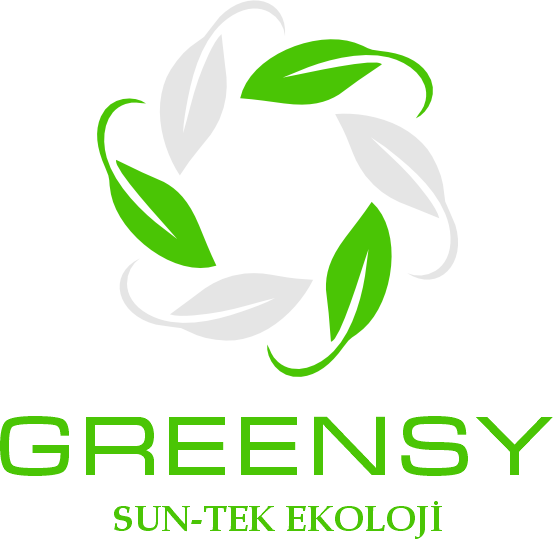

# 🌱 GREENSY - Transformation Technology

[](https://reactjs.org/)
[](https://nodejs.org/)
[](LICENSE)

> **Transformation Technology Giving Life to Soil, Air and Life**

<div align="center">
  
  
  *The Future is Entrusted to Us*
</div>

## 📖 About the Project

GREENSY is a transformation technology developed with inspiration from nature, creating a revolution in agriculture, livestock, and living spaces with negative ion technology. This website is developed for the introduction and information of GREENSY technology.

### 🌟 Features

- **Responsive Design**: Perfect appearance on all devices
- **Multi-language Support**: Turkish and English language support
- **Modern UI/UX**: User-friendly and modern interface
- **Animations**: Smooth transitions and interactions
- **SEO Optimized**: Search engine friendly structure
- **Performance**: Fast loading and optimized code

### 🛠️ Technology Stack

- **Frontend**: React 18, React Router
- **Styling**: CSS3, Custom Fonts (Microgramma, Birthstone)
- **Build Tool**: Create React App
- **Deployment**: Ready for production deployment

## 🚀 Installation

### Requirements

- Node.js (v16 or higher)
- npm or yarn

### Steps

1. **Clone the repository**
   ```bash
   git clone https://github.com/yourusername/greency.git
   cd greency
   ```

2. **Install dependencies**
   ```bash
   npm install
   ```

3. **Start development server**
   ```bash
   npm start
   ```

4. **Open in your browser**
   ```
   http://localhost:3000
   ```

## 📁 Project Structure

```
greency/
├── public/                 # Static files
├── src/
│   ├── fonts/             # Custom fonts
│   │   ├── microgrammanormal.ttf
│   │   └── DancingScript-Bold.ttf
│   ├── images/            # Images
│   │   ├── fields/        # Usage areas
│   │   ├── product/       # Product images
│   │   └── slider/        # Slider images
│   ├── App.js             # Main application component
│   ├── App.css            # Main style file
│   ├── Navbar.js          # Navigation component
│   └── Footer.js          # Footer component
├── package.json
└── README.md
```

## 🎨 Pages

### 🏠 Home Page
- GREENSY technology introduction
- Video background
- Call-to-action buttons

### 🔬 Our Technology
- Detailed technology explanation
- Benefits and features
- Gallery section

### 🌾 Areas of Use
- Agricultural applications
- Livestock solutions
- Indoor space usage
- Food industry

### 👥 About Us
- Company story
- Mission and vision
- Our values

### ❓ FAQ
- Frequently asked questions
- Detailed answers

### 📞 Contact
- Contact form
- Email integration

## 🎯 Feature Details

### Responsive Design
- Mobile-first approach
- Tablet and desktop optimization
- Flexible grid system

### Performance
- Lazy loading
- Optimized images
- Minimal bundle size

### Accessibility
- WCAG compliant
- Keyboard navigation
- Screen reader support

## 🚀 Deployment

### Production Build
```bash
npm run build
```

### Deployment Options
- **Netlify**: Automatic deployment
- **Vercel**: Serverless deployment
- **GitHub Pages**: Static hosting
- **AWS S3**: Cloud hosting

## 🤝 Contributing

1. Fork the project
2. Create your feature branch (`git checkout -b feature/AmazingFeature`)
3. Commit your changes (`git commit -m 'Add some AmazingFeature'`)
4. Push to the branch (`git push origin feature/AmazingFeature`)
5. Open a Pull Request

## 📝 License

This project is licensed under the MIT License. See the [LICENSE](LICENSE) file for details.

## 📞 Contact

- **Email**: info@suntekekoloji.com
- **Website**: [suntekekoloji.com](https://suntekekoloji.com)
- **LinkedIn**: [Sun-Tek Ecology](https://linkedin.com/company/sun-tek-ekoloji)

## 🙏 Acknowledgments

- React team
- Create React App team
- All contributors

---

<div align="center">
  <strong>🌱 GREENSY - Nature's Power, Modern Technology</strong>
</div>
